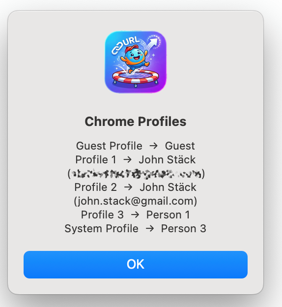

# URLBouncer

A macOS menu bar app that intercepts every link you click in any application (Slack, Mail, etc.) and opens it in the right Google Chrome profile based on configurable rules.

## Requirements

- macOS 12+
- Python 3.10+
- Google Chrome

## Install

```bash
make install
```

This builds the app bundle, copies it to `/Applications/`, and registers it with macOS.

Then launch it once:

```bash
open /Applications/URLBouncer.app
```

A `[↗]` icon will appear in your menu bar.

## Set as default browser

Go to **System Settings → Desktop & Dock → Default web browser** and select **URLBouncer**.

From this point on, every link clicked in any app will go through URLBouncer before reaching Chrome.

## Configure rules

Your config file lives at `~/.config/urlbouncer/config.yaml`. The easiest way to open it is via the menu bar: **[↗] → Open Config**.

```yaml
rules:
  - match: "github.com"
    profile: "Profile 1"   # work
  - match: "youtube.com"
    profile: "Profile 2"   # personal

default_profile: "Profile 2"
```

Rules are matched top-to-bottom; the first match wins. No restart is needed after editing — the config is re-read on every link click.

### Match syntax

| Example | Matches against |
|---------|----------------|
| `"github.com"` | Hostname (case-insensitive substring) |
| `"github.com/myorg/"` | Full URL (pattern contains `/`) |
| `"re:^https://meet\\.google\\.com/"` | Full URL regex (prefix `re:`) |

### Finding your profile directory names

Click **[↗] → Chrome Profiles** to see a dialog like this:



The left column (`Profile 1`, `Profile 2`, etc.) is what you put in the config. The right side shows the account name and email so you can tell them apart.

## Menu bar options

| Item | What it does |
|------|-------------|
| Open Config | Opens `~/.config/urlbouncer/config.yaml` in your default text editor |
| Reload Config | Confirms how many rules are loaded (config is always live, this is just for verification) |
| Chrome Profiles | Shows all detected Chrome profiles with names and emails |
| Show Log | Opens the log in Console.app (`~/Library/Logs/URLBouncer/urlbouncer.log`) |
| Quit URLBouncer | Exits the app (links will stop working until you relaunch) |

## Testing without setting as default browser

You can test the app before changing your default browser by sending it a URL directly from the terminal:

```bash
osascript -e 'tell application "URLBouncer" to open location "https://github.com/test"'
```

Watch what happens in real time:

```bash
tail -f ~/Library/Logs/URLBouncer/urlbouncer.log
```

## Auto-start on login

To have URLBouncer start automatically when you log in, open **System Settings → General → Login Items** and add `/Applications/URLBouncer.app`.

## Updating after config or code changes

If you only edited `~/.config/urlbouncer/config.yaml`, no action is needed — changes are live immediately.

If you changed source files in `src/`, rebuild and relaunch:

```bash
make install
open /Applications/URLBouncer.app
```
